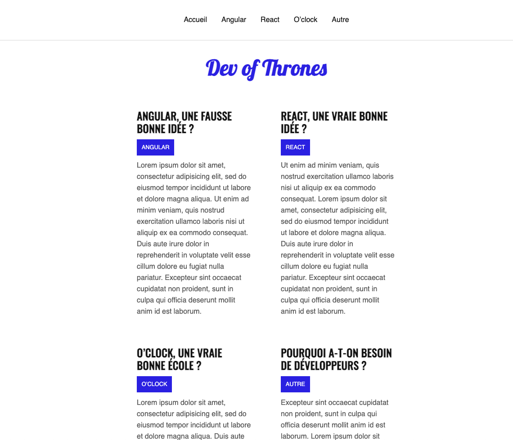

# :writing_hand: Dev Blog React

## Create a blog page with React.

## Illustration

## Language/tools
- HTML5
- CSS3/SCSS
- Javascript/REACT
- Webpack
- PropTypes
- React-router-dom
- Babel

## Goals 
- Discover React (web page usage)
- Modularize the code using components
- Discover react-router-dom

## Status
Project completed

## Context
Project carried out during my training as a web developer